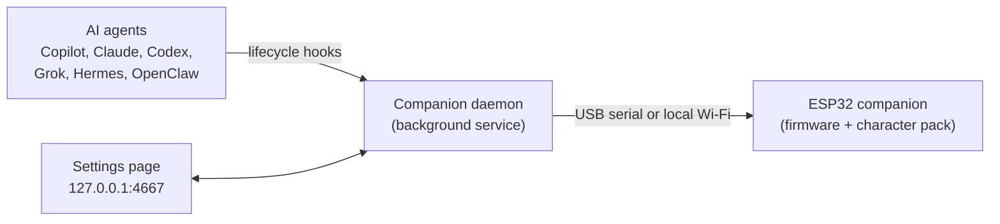
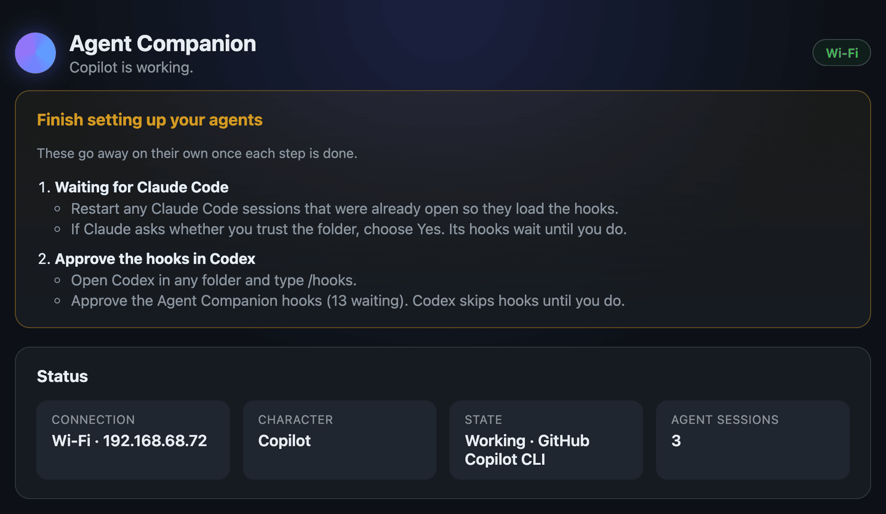
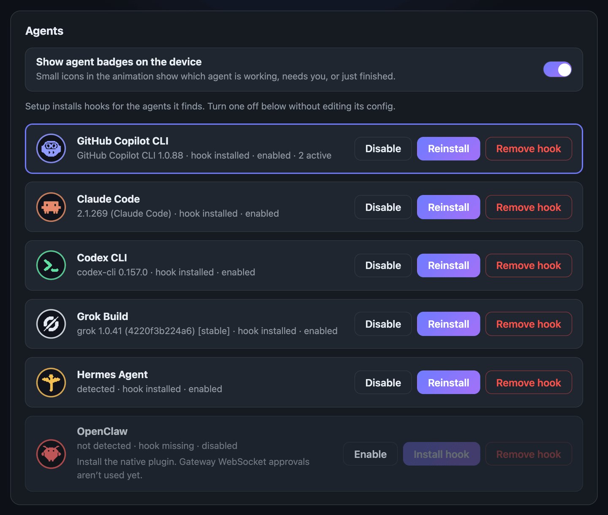
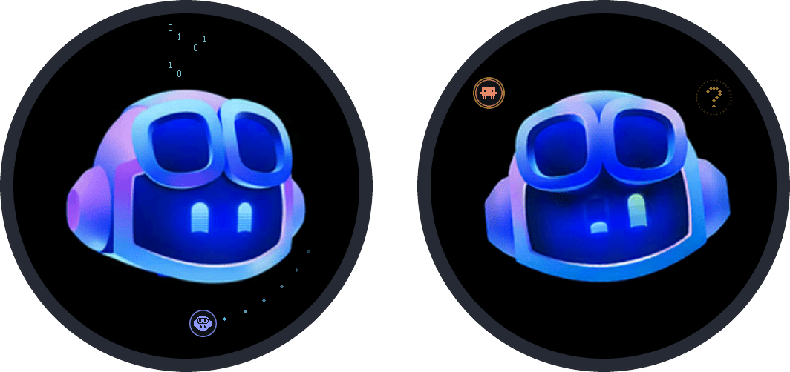
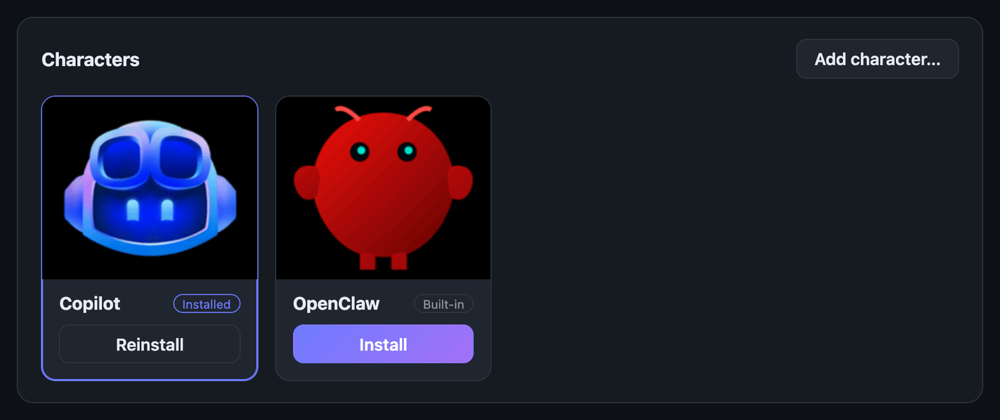
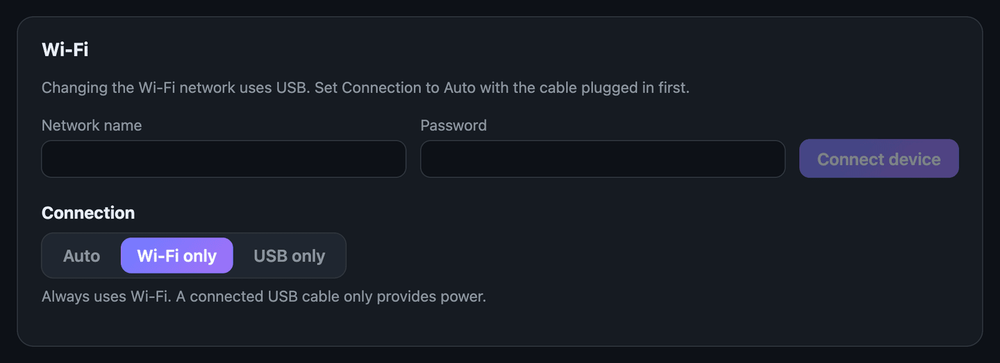

<p align="center">
  
</p>

<h1 align="center">ESP32 Agent Companion</h1>

<p align="center">
  An animated desk companion that shows what your AI coding agents are doing.
</p>

<p align="center">
  <a href="https://github.com/DanWahlin/esp32-agent-companion/releases/latest"></a>
  <a href="https://github.com/DanWahlin/esp32-agent-companion/actions/workflows/build.yml"></a>
</p>

ESP32 Agent Companion works with the
[Waveshare ESP32-S3-Touch-AMOLED-1.75-B or -C](https://www.amazon.com/dp/B0FBWDL117)
and turns it into a character that reacts to your AI coding agents. When GitHub Copilot,
Claude Code, Codex CLI, Grok Build, Hermes Agent, or OpenClaw starts working,
needs your approval, or finishes, the character shows it, along with a small
badge for the agent involved.

Everything runs locally. There's no cloud service, account, or subscription, and
the device works over USB or your local Wi-Fi.

Want it on your screen as well? The [Desktop Agent Companion](#desktop-agent-companion)
puts the same character, with the same animation, in a transparent window on your
desktop, with or without the device.

<p align="center">
  
</p>

## Contents

- [Features](#features)
- [How it works](#how-it-works)
- [What you need](#what-you-need)
- [Quick start](#quick-start)
- [Step 1: Flash the firmware](#step-1-flash-the-firmware)
- [Step 2: Install the companion daemon](#step-2-install-the-companion-daemon)
- [Step 3: Finish setting up your agents](#step-3-finish-setting-up-your-agents)
- [Step 4: Try it](#step-4-try-it)
- [Using the device](#using-the-device)
- [Agents](#agents)
- [Agent badges](#agent-badges)
- [AI credits and tokens](#ai-credits-and-tokens)
- [Characters](#characters)
- [Wi-Fi](#wi-fi)
- [Update](#update)
- [Command reference](#command-reference)
- [Troubleshooting](#troubleshooting)
- [Desktop Agent Companion](#desktop-agent-companion)
- [Develop and customize](#develop-and-customize)

## Features

- **Agent-aware states:** Working, Needs attention, and Complete animations driven
  by your agents' lifecycle hooks, with sessions from several agents combined.
- **Agent badges:** small icons show which agent is working, waiting on you, or
  just finished.
- **Usage:** GitHub Copilot AI credits (`AIC`) and agent tokens, at the bottom
  of the screen.
- **Six supported agents:** GitHub Copilot, Claude Code, Codex CLI, Grok Build,
  Hermes Agent, and OpenClaw.
- **Swappable characters:** the device holds one character pack at a time. It
  ships with Copilot, and you can install OpenClaw, Claude, or your own pack over USB or Wi-Fi.
- **Settings page:** a local web page for agents, badges, characters, Wi-Fi, the
  connection mode, and the desktop app, with light and dark themes.
- **Natural motion:** eight looking directions, blinks, touch reactions, and a
  sleep cycle after two idle minutes.
- **Automatic orientation:** the onboard accelerometer keeps the character,
  settings, installation screens, firmware prompts, and touch controls upright
  when the device is rotated. Web Settings can save a per-device alignment trim.
- **Wi-Fi or USB:** run it tethered to your computer or from any USB power source
  on the same network.
- **Optional sound:** short local sound cues through the board's speaker connector,
  and the same cues from the desktop app when you turn them on.

## How it works



1. **Firmware** runs the animation on the device. Install it from the desktop
   app, or flash it from a release.
2. **Hooks** in each agent's config report events such as "started a tool",
   "needs permission", and "finished".
3. **The companion daemon** runs in the background on your computer. It combines
   those events into one state, sends it to the device, and serves the settings page.

## What you need

| Item | Details |
| --- | --- |
| Device | **Waveshare ESP32-S3-Touch-AMOLED-1.75-B or 1.75-C** from [Amazon](https://www.amazon.com/dp/B0FBWDL117) or [Waveshare](https://www.waveshare.com/esp32-s3-touch-amoled-1.75.htm?sku=31262) |
| Cable | A USB data cable (charge-only cables won't work) |
| Computer | macOS, Linux, or Windows (x64 or Arm64). On Windows, the desktop app runs the companion service natively, and agents in [WSL 2](#windows-wsl-2) use it too. |
| Python | [3.10 or newer](https://www.python.org/downloads/), for flashing. The `python3` that comes with macOS is too old. |
| Node.js and Git | Only to run the companion daemon from the repository: [Node.js 24 LTS](https://nodejs.org/) (24.11 or newer) and Git. The desktop app carries its own. |
| Speaker (optional) | A small two-pin speaker, if your board or enclosure doesn't include one |
| Desktop app | Nothing extra to download and run it. To build it from source, install [Rust](https://rustup.rs/) 1.90 or newer and the OS build dependencies. |

## Quick start

**With the desktop app (recommended).** You need only the
app. You do not need Python, Node.js, or a clone of the repository.

1. Download the desktop app for your OS from
   [Releases](https://github.com/DanWahlin/esp32-agent-companion/releases/latest):
   `agent-companion-desktop-<version>-macos-universal.dmg`,
   `agent-companion-desktop-<version>-windows-x64-setup.exe`,
   `agent-companion-desktop-<version>-windows-arm64-setup.exe`,
   `agent-companion-desktop-<version>-linux-x86_64.AppImage`, or
   `agent-companion-desktop-<version>-linux-amd64.deb`.
2. Open the app. It is not code-signed, so see
   [Run the desktop app](#run-the-desktop-app) for the first-run step on your
   OS. If no service is running, the first run installs
   the companion service and your agents' hooks. Then it opens Settings.
3. Connect the device with a USB data cable. In Settings, open the **Device**
   tab. In the **Install over USB** row, select **Install v<version>**. The app
   downloads the matching firmware release from GitHub, checks it, and writes it
   to the device. The device restarts when the install finishes.
4. In Settings, connect Wi-Fi on the **Device** tab if you want to untether the
   device. Choose a character on the **Characters** tab.

Use the same **Install v<version>** button later to install the firmware again or
to repair the device. The character on your desktop follows the device
([details](#run-the-desktop-app)).

**Without the desktop app** (to change the code, or on Windows in WSL 2):

1. Put the firmware on the device with `flash.py` from the release's
   `esp32-agent-companion-v<version>-firmware.zip` asset. This needs
   Python 3.10 or newer. Extract it, connect the device over USB, and run this
   in the extracted folder:

   ```bash
   python3 -m venv .venv && .venv/bin/python -m pip install -r requirements.txt
   .venv/bin/python flash.py --list-ports                 # find your device's port
   .venv/bin/python flash.py --port /dev/cu.usbmodem2101  # use that port; type FLASH
   ```

   Windows commands are in [Step 1](#step-1-flash-the-firmware).
2. Start the companion service from the repository. This needs Node.js 24.11 or
   newer:

   ```bash
   git clone https://github.com/DanWahlin/esp32-agent-companion.git
   cd esp32-agent-companion
   npm run setup      # installs agent hooks, starts the service, opens Settings
   npm run status     # should say: Connected over USB
   npm run settings   # opens the Settings page again at any time
   ```

3. Optional: show the character on your desktop. Download the app too, or build
   and run it from the same folder (needs Rust): `npm run desktop`. The app
   follows the service that runs from the repository.

Restart any agent sessions that were already open, then start one and watch the
character react ([Step 4](#step-4-try-it)).

To open Settings in the app's own window, click the upper button on the
desktop character's case, press the BOOT button on the real device, or
right-click the character and select **Settings**. The lower button
turns the app's sounds on or off. Turn the character off, hide the device around
it, or turn on sounds on the **Desktop** tab in Settings.

## Step 1: Flash the firmware

The easiest way is the desktop app: open Settings, go to the **Device** tab, and
click **Install v<version>** in the **Install over USB** row (see [Quick start](#quick-start)).
The steps below use `flash.py` instead, for computers without the desktop app.
You don't need Arduino tools or the source code for them. If you'd rather build
the firmware yourself, see [Build from source](docs/build-from-source.md).

1. Check that you have Python 3.10 or newer:

   ```bash
   python3 --version      # Windows PowerShell: py -3 --version
   ```

   The `python3` that comes with macOS is 3.9. If that's what you see, install a
   newer Python from [python.org](https://www.python.org/downloads/) or with
   `brew install python`, then open a new terminal and check again.

2. From [Releases](https://github.com/DanWahlin/esp32-agent-companion/releases/latest),
   download `esp32-agent-companion-v<version>-firmware.zip` and extract it.
3. Open a terminal in the extracted folder (it contains `flash.py`) and install
   the flashing tool:

   **macOS / Linux**

   ```bash
   python3 -m venv .venv
   .venv/bin/python -m pip install -r requirements.txt
   ```

   **Windows PowerShell**

   ```powershell
   py -3 -m venv .venv
   .\.venv\Scripts\python.exe -m pip install -r requirements.txt
   ```

4. Connect the device with the USB data cable, find its port, and flash it:

   **macOS / Linux**

   ```bash
   .venv/bin/python flash.py --list-ports
   .venv/bin/python flash.py --port /dev/cu.usbmodem2101
   ```

   **Windows PowerShell**

   ```powershell
   .\.venv\Scripts\python.exe flash.py --list-ports
   .\.venv\Scripts\python.exe flash.py --port COM5
   ```

   Use the port that `--list-ports` shows for your board. macOS ports look like
   `/dev/cu.usbmodem…`, and Linux ports look like `/dev/ttyACM0`. Type `FLASH`
   when prompted.

When it finishes, the device restarts and the Copilot character starts looking
around. Leave the cable plugged in for the next step.

> [!WARNING]
> Flashing replaces the board's existing firmware and partition table. Back up
> anything you need from its previous firmware first.

<details>
<summary><strong>Flashing troubleshooting</strong></summary>

- **The device isn't listed:** make sure the cable carries data, and close any
  serial monitor that's using the port.
- **"Python 3.10 or newer is required":** the environment was created with an
  older Python. Recreate it with a newer one, for example
  `python3.13 -m venv --clear .venv`, and install the requirements again.
- **Linux can't create the environment:** install your distribution's
  `python3-venv` package.
- **Download mode or connection problems:** see the
  [Waveshare board guide](https://www.waveshare.com/wiki/ESP32-S3-Touch-AMOLED-1.75).
- Don't flash the application `.bin` on its own or mix files from different
  releases. `flash.py` writes the matched set at the right addresses.

</details>

## Step 2: Install the companion daemon

The daemon connects your agents to the device and runs in the background.

**With the desktop app.** Download the app and open it (see
[Run the desktop app](#run-the-desktop-app)). If no daemon runs, the app installs
the one it carries: the same service and hooks that setup below installs. It then
opens Settings. Restart any agent sessions that were already open. On Linux, the
serial port note below also applies.

**From the repository.** With the device plugged in over USB, clone the
repository and run setup:

```bash
git clone https://github.com/DanWahlin/esp32-agent-companion.git
cd esp32-agent-companion
npm run setup
```

Setup installs a hook for each agent it finds on your computer, then starts a
background service (a macOS LaunchAgent or a Linux systemd user service) so the
daemon starts whenever you sign in. When it's done, it opens the settings page.

Check that the daemon found the device:

```bash
npm run status
```

You should see `Connected over USB`. If it says no device is connected, see
[Troubleshooting](#troubleshooting).

Restart any agent sessions that were already open so they load the new hooks.

> [!TIP]
> The service saves your shell's `PATH` so it finds the same agents you do. If
> you install a new agent later, run `npm run setup` again.

<details>
<summary><strong>Linux: serial port permission errors</strong></summary>

Add your user to the `dialout` group, then sign out and back in:

```bash
sudo usermod -aG dialout "$USER"
```

</details>

<a id="windows-wsl-2"></a>
<details>
<summary><strong>Windows (WSL 2)</strong></summary>

The easiest way on Windows is the desktop app (see [Quick start](#quick-start)). Its
service runs on Windows and installs hooks for agents on Windows and in running WSL 2
distributions, and it uses the device's USB port with no extra steps.

To run the daemon from a clone inside WSL instead, run your agent CLIs and the daemon
**inside the same WSL 2 distribution**. Hooks installed in WSL can't see agents running
natively on Windows.

1. Install Node.js 24 LTS inside WSL.
2. If systemd isn't enabled, add this to `/etc/wsl.conf`, then run `wsl --shutdown`
   from PowerShell and reopen WSL:

   ```ini
   [boot]
   systemd=true
   ```

3. Windows doesn't share USB devices with WSL automatically. Install
   [`usbipd-win`](https://learn.microsoft.com/windows/wsl/connect-usb), connect
   the device, and run this in PowerShell:

   ```powershell
   usbipd list
   # Once, in an Administrator PowerShell, using the ESP32's BUSID:
   usbipd bind --busid <BUSID>
   # Each time you want to use the device from WSL:
   usbipd attach --wsl --busid <BUSID>
   ```

4. In WSL, confirm that `/dev/ttyACM*` or `/dev/ttyUSB*` exists, then follow the
   Linux steps above. While the device is attached to WSL, Windows apps can't use it.

The settings page link opens in your Windows browser.

</details>

## Step 3: Finish setting up your agents

Setup opens the settings page for you. To open it again later, run:

```bash
npm run settings
```

The page runs only on your computer and needs the private link that
`npm run settings` opens, so other websites and devices can't reach it. The link
survives restarts, so you can bookmark it.

Some agents need a one-time step before their hooks run, such as approving the
hooks in Codex. When that's the case, a **Finish setting up your agents** panel
lists exactly what to do. Each step disappears once the daemon sees it's done. If
there's no panel, you're all set.

<p align="center">
  
</p>

## Step 4: Try it

Start a new session in one of your agents and ask it to do something that uses a
tool, such as reading a file. The character should:

1. Switch to **Working** while the agent runs.
2. Switch to **Needs attention** if the agent asks for your permission.
3. Celebrate with **Complete** when the turn finishes, then return to **Idle**.

The settings page's **Status** card shows the current state and which agent is
driving it. If the character doesn't react, see
[Troubleshooting](#troubleshooting).

## Using the device

The character works as soon as it's flashed, even without the daemon.

| State | What you'll see | Triggered by |
| --- | --- | --- |
| Idle | Looks around and blinks | No agent activity |
| Working | Focused eyes, orbiting dots, and drifting binary digits | An agent is running a turn or tool |
| Needs attention | Curious head tilts and an amber question mark | An agent is waiting for permission or input |
| Complete | A short celebration | An agent finished a turn that used tools |
| Surprise | A quick spring-like recoil | Tapping the character |
| Sleep | Drowsy eyelids and drifting Zs | Two uninterrupted idle minutes; wakes after one minute |

**Swipe up** to open the on-device settings menu. Swipe down or select **Close**
to return to the character. The menu also closes on its own after 30 seconds
without a touch.

| Control | What it does |
| --- | --- |
| Wi-Fi status (top) | Shows the connection and network name. Tap it for network details and **Setup Wi-Fi**. |
| Brightness | Adjusts display brightness |
| Volume | Sets sound from Off to 100% (default 50%, remembered across restarts) |
| Character | Shows the installed character |
| Character state | Previews Idle, Working, Complete, Needs attention, or Surprise |

**Press the BOOT button** on the board to open the companion's Settings on your
computer. This needs the daemon, connected over USB or Wi-Fi (over Wi-Fi, it can
take up to three seconds). If the [desktop app](#desktop-agent-companion) is
running, Settings opens in its window. If not, Settings opens in your browser.
Don't use the PWR button for this: holding it turns the board off.

Sound plays through the board's two-pin speaker connector. Connect a small speaker
if your board or enclosure doesn't include one. The [desktop app](#desktop-agent-companion)
can play the same sounds through your computer; the device's volume does not
change them.

## Agents

Setup installs a hook for every agent it detects. Hooks only notify the daemon;
if the daemon or device isn't running, your agents keep working normally.

| Agent | Hook location | One-time step |
| --- | --- | --- |
| GitHub Copilot (CLI and app) | `~/.copilot/hooks/agent-companion.json` | None |
| Claude Code | `~/.claude/settings.json` | Accept Claude's folder-trust prompt if it asks |
| Codex CLI | `~/.codex/hooks.json` | Approve the hooks in Codex with `/hooks` |
| Grok Build | `~/.grok/hooks/agent-companion.json` | None |
| Hermes Agent | `~/.hermes/config.yaml` (Windows: `%LOCALAPPDATA%\hermes\config.yaml`) | Approve each hook the first time Hermes runs it |
| OpenClaw | A plugin registered with the `openclaw` CLI | Restart the OpenClaw Gateway |

Setup edits only the hook entries it owns. Before it changes a file, it keeps a
copy beside it: `<file>.bak` holds the file as it was before the first change, and
`<file>.agent-companion-<time>.bak` holds it as it was before each change (the
last five are kept). It doesn't touch a file that has nothing to change, and it stops without
changes if a file's `hooks` section is in a format it doesn't understand.

Grok also runs the hooks in Claude's settings. If you use both, Grok can show a
line such as `PreToolUse hook (global/settings) failed, ignored` for the Agent
Companion Claude hook. This doesn't change the display, because Grok's own hook
sends the events. To stop the message, add this to `~/.grok/config.toml`. Grok
then skips all of your Claude hooks, not only this one:

```toml
[compat.claude]
hooks = false
```

On Windows, Codex and Grok run their hooks in PowerShell, so setup writes the
Windows hook command in the PowerShell form
(`& 'node.exe' 'cli.js' hook <agent> <event>`). After an update from an older
version, Settings shows these hooks as outdated. Click **Reinstall**, and then
approve the Codex hooks again with `/hooks`.

If you moved an agent's settings folder with its own variable (`COPILOT_HOME`,
`CLAUDE_CONFIG_DIR`, `CODEX_HOME`, `GROK_HOME`, `HERMES_HOME` or `OPENCLAW_HOME`),
setup uses that folder instead of the one in the table. Set the variable in your
shell's startup file (for example, `~/.zshrc` or `~/.bashrc`): the service and the
desktop app read it from there, and keep it. If you change it later, run setup
again, or open a newer version of the desktop app.

If you remove an agent's hook, it stays removed. Setup and desktop app updates
don't add it back until you choose **Install hook** or run
`npm run agents install <agent>`.

The settings page's **Agents** tab lists every supported agent with its detected
version and hook status. An agent that's driving the display is highlighted.
The GitHub Copilot app runs its own Copilot CLI with the same `~/.copilot` folder,
so one hook file covers the CLI and the app; on macOS, the card shows the version
of each one that's installed.

<p align="center">
  
</p>

| Control | What it does |
| --- | --- |
| **Disable** / **Enable** | Stops or resumes that agent's control of the device, without touching its config |
| **Install hook** / **Reinstall** | Writes (or rewrites) the hook into the agent's config |
| **Remove hook** | Removes only this project's hook from the agent's config |

A hook status of **outdated** means the hooks run another copy of the companion
(for example, a repository install instead of the desktop app), a Node.js or
companion file that no longer exists, or not all of the events. Choose
**Reinstall** to fix it.

The same actions are available from the command line:

```bash
npm run agents                     # List agents, versions, and hook status
npm run agents disable claude      # Stop an agent from driving the device
npm run agents enable claude
npm run agents install codex       # Install or reinstall one hook
npm run agents uninstall codex     # Remove one hook
```

Codex links each hook approval to the hook's position in `~/.codex/hooks.json`.
If removing or reinstalling the companion's hook moves one of your own approved
Codex hooks, Settings and `npm run agents` show a warning that names it. Open
Codex, type `/hooks`, and approve it again.

Removing a Hermes hook doesn't revoke its approval. To clean that up too, run
`hermes hooks revoke "<command>"` with the command shown in its config.

<details>
<summary><strong>How agent events become device states</strong></summary>

- Active agent or subagent work maps to **Working**.
- Permission and input prompts, and errors that end a turn, map to
  **Needs attention**, which takes priority over every other session. Prompts
  from one-shot runs (`copilot -p`, `claude -p`, `codex exec`, `grok -p`, and
  `hermes -z`) are ignored, because no one can answer them.
- A finished turn that used tools maps to **Complete**.
- Inactive sessions return to **Idle**.

Sessions from different agents and terminals are tracked separately, so one agent
finishing doesn't hide another that's still working.

</details>

## Agent badges

Badges show which agent is behind the current state. Working badges ride the
orbiting dots, Needs attention badges pulse amber opposite the question mark,
and Complete briefly shows the agents that just finished. Idle, Sleep, and
Surprise don't show badges.

<p align="center">
  
</p>

Badges are on by default. Turn them off with the **Show agent badges on the
device** switch on the settings page's Agents tab, or with `npm run badges off`
(`npm run badges on` brings them back).

<details>
<summary><strong>Use your own badge icons</strong></summary>

To replace a built-in icon, put a PNG named after the agent (for example
`copilot.png`) in the `icons` folder of the daemon's data directory:

- macOS: `~/Library/Application Support/ESP32 Agent Companion/icons/`
- Linux: `~/.local/state/esp32-agent-companion/icons/`

The daemon converts 8-bit, non-interlaced PNGs to a 24 x 24 mask using alpha or
brightness. An optional `copilot.json` next to it can set the accent color used
for the icon and ring: `{ "color": "#RRGGBB" }`.

</details>

## AI credits and tokens

The device can show how much your agents used, centered at the bottom of the
screen:

- **AIC:** GitHub Copilot AI credits, read from the `session.usage_checkpoint`
  and `session.shutdown` events in `~/.copilot/session-state/`. This is the same
  value that Copilot CLI shows as "AIC used", and it includes sub-agents. Copilot
  writes it at the end of each turn, so the value changes when a turn ends. It
  counts only the Copilot CLI and app sessions on this computer. It does not
  include VS Code, the cloud agent, or other computers, so it is not your
  account's bill.
- **Tokens:** input plus output tokens for Claude Code (`~/.claude/projects/`)
  and Codex CLI (`~/.codex/sessions/`). Cache reads are not counted. GitHub
  Copilot tokens are not counted, because Copilot records them only when a
  session stops cleanly, so the local count is not complete. Copilot has AIC.

The device shows one line, for what is running now:

- While a GitHub Copilot session runs, it shows `AIC` only.
- While no Copilot session runs but another agent runs, it shows `Tokens` only.
- While no agent runs, it shows no line.

The settings page's Status card shows each value that has usage. Large values get commas
(`AIC: 12,345`), then a short form (`Tokens: 1.2M`).

Usage is on by default. On the settings page's Agents tab, use the **Show usage
on the device** switch and choose the **Usage period**: **Today**, **This
month**, or **Active sessions**. The Status card shows the same values in the
**Usage** box. The desktop app shows the lines too.

The device needs firmware with protocol 8 or later. Older firmware does not show
usage, but everything else works.

## Characters

The device holds one character at a time. The settings page's **Characters** tab
shows each character you can install, with the current one marked **Installed**.

<p align="center">
  
</p>

- Select **Install** to switch characters. A progress bar tracks the transfer,
  which takes about a minute, and the device restarts when it's done.
- Select **Add character…** to upload your own `.acpk` pack. Packs you've added
  have a **Remove** button.

Or switch from the command line:

```bash
npm run character              # List the characters you can install
npm run character openclaw     # Install OpenClaw
npm run character claude       # Install Claude
npm run character copilot      # Switch back to Copilot
```

You can also pass the path to any `.acpk` pack, such as one from a release's
`esp32-agent-companion-v<version>-characters.zip` asset. The daemon remembers
your choice. If an install is interrupted, the device shows **No character installed** until the daemon
reinstalls your character, which it does as soon as the device reconnects.

Some characters, such as Claude, need newer firmware than others. If the daemon
says a character needs newer device firmware, reflash the latest release
([see Update](#update)) and install it again.

## Wi-Fi

Wi-Fi lets the companion run from a wall adapter or any USB power source. Your
computer and the device need to be on the same local network, and the device
needs a 2.4 GHz network.

**From the settings page (recommended).** Use the **Device** tab:

<p align="center">
  
</p>

1. Plug the device in over USB and set **Device connection** (on the **Status**
   card) to **Auto**.
2. Choose your network from **Nearby network**, or type its name in **Or type a
   network name** if it's hidden or not listed. Enter the password, then select
   **Connect device**. The daemon sends the credentials over USB and pairs with the
   device automatically. The list comes from the device's own radio, so it shows
   only 2.4 GHz networks the device can join. Select **Scan** to refresh it.
   The Status card shows **(not connected)** after the network name until the device
   joins. If it stays there, check the password and that the network has 2.4 GHz turned on.
3. Unplug the device from your computer and power it from any USB source. It
   keeps working over Wi-Fi.

**From the command line.** With the device plugged in over USB, run:

```bash
npm run wifi "Your 2.4 GHz network"
```

The command asks for the password without showing it or saving it in your shell
history.

**From the device.** Swipe up, tap the Wi-Fi status, then select **Setup Wi-Fi**.
Join the temporary `Agent-Companion-XXXX` network with the eight-digit password
on screen, open <http://192.168.4.1>, and enter your network. Then reconnect your
computer to your usual network and pair it with the same code:

```bash
npm run pair 12345678
```

The setup network and code expire after ten minutes.

**Connection modes.** Choose how the daemon reaches the device with **Device
connection** on the settings page's **Status** card, or with `npm run connection auto|wifi|usb`:

| Mode | Behavior |
| --- | --- |
| **Auto** (default) | Uses USB when the cable is connected, otherwise Wi-Fi |
| **Wi-Fi only** | Always uses Wi-Fi; a connected USB cable only provides power |
| **USB only** | Only uses USB |

<details>
<summary><strong>Network requirements and security</strong></summary>

- Guest networks, client isolation, VPN policies, and firewalls that block local
  HTTP or UDP discovery can prevent Wi-Fi operation. USB always works.
- Your network name and password are stored only on the device. The computer
  keeps only a pairing token.
- Requests from the daemon to the device are authenticated with the pairing
  token and stay on your local network.
- Bluetooth isn't supported.

</details>

## Update

**Companion daemon.** If the desktop app installed it, install the new release
of the app and open it: the app updates its copy of the service. The settings
page's Status card shows the **Versions** of the service and the desktop app,
and tells you when they are different. If you set it
up from the repository, run this in the repository folder:

```bash
git pull
npm run setup
```

Setup installs any new dependencies, rebuilds the daemon, restarts the background
service, and installs hooks for any agents you've added. New or updated
characters show up on the settings page on their own.

**Firmware.** Reflash only when a release's notes mention firmware changes. With
the desktop app, update the app first. Then connect the device over USB, open the
**Device** tab in Settings, and click **Install v<version>** in the
**Install over USB** row. The button installs the firmware release that matches
the companion service's version. Without the desktop app, follow [Step 1](#step-1-flash-the-firmware)
with the new release's `esp32-agent-companion-v<version>-firmware.zip`. Both
ways keep the device's Wi-Fi settings but put the Copilot character back.
Reinstall your character afterward from the settings page or with `npm run character <name>`.

**Firmware over Wi-Fi.** When the device is on Wi-Fi and has firmware with
protocol 9 or later, open the settings page's **Device** tab. The **Device
firmware** row compares the device with the firmware that you built with
`bash tools/arduino.sh build`. If they are different, click **Update**.
Protocol 11 or later firmware then shows **Press BOOT to allow it**. Press the
BOOT button on the device in 60 seconds. That press allows this update only and
does not open Settings. The daemon then sends the new firmware over Wi-Fi, and
the device restarts in about 15 seconds. This keeps your character and Wi-Fi
settings. If the new firmware cannot join Wi-Fi in 90 seconds, the device goes
back to the previous firmware.

The first change to this firmware needs one USB flash, because it adds a second
firmware slot to the partition table. Updates over Wi-Fi do not change the
partition table, so a release that changes it also needs a USB flash.

## Command reference

Run these from the repository folder.

| Command | What it does |
| --- | --- |
| `npm run setup` | Installs or updates the daemon, agent hooks, and background service. Add `-- --no-open` to skip opening the browser. |
| `npm run settings` | Opens the settings page |
| `npm run status` | Shows the connection, character, state, and any pending agent steps |
| `npm run agents` | Lists agents with their versions and hook status |
| `npm run agents enable\|disable <agent>` | Lets an agent drive the device, or stops it |
| `npm run agents install\|uninstall <agent>` | Installs or removes one agent's hook |
| `npm run badges on\|off` | Shows or hides agent badges |
| `npm run character [name\|path]` | Lists characters, or installs one |
| `npm run wifi "<network>"` | Puts the device on Wi-Fi over USB |
| `npm run pair <code>` | Pairs with a device set up from its own Wi-Fi screen |
| `npm run connection auto\|wifi\|usb` | Sets how the daemon reaches the device |

## Troubleshooting

<details>
<summary><strong>"No device is connected"</strong></summary>

1. Make sure the cable carries data and is plugged in. Close any serial monitor or
   `flash.py` run that's still using the port.
2. If the connection mode is **Wi-Fi only**, USB is ignored. Run
   `npm run connection auto`.
3. On Linux, add your user to the `dialout` group
   ([see Step 2](#step-2-install-the-companion-daemon)). In WSL, attach the device
   with `usbipd` ([see Windows](#windows-wsl-2)).
4. For Wi-Fi, check the items under **Wi-Fi won't connect** below.

</details>

<details>
<summary><strong>The device doesn't react to an agent</strong></summary>

1. Run `npm run status` and confirm the device is connected. It also lists any
   pending one-time agent steps.
2. Restart agent sessions that were open before you ran setup.
3. Check the settings page's **Agents** tab: the agent should show
   **hook installed** and **enabled**. If it shows **hook outdated**, choose
   **Reinstall**.
4. If you installed the agent after setup, or you removed its hook before,
   choose **Install hook** for it on the **Agents** tab.

</details>

<details>
<summary><strong>Install over USB fails or is not available</strong></summary>

- **Needs the desktop app:** the desktop app writes the firmware. Open it, then
  open Settings again. An older desktop app cannot install firmware; install the
  latest one.
- **No BOOT press needed:** a normal USB install resets the device into download
  mode itself. Press BOOT only for the recovery step below.
- **No USB device:** use a USB data cable, and close any serial monitor that uses
  the port.
- **Download failed:** the computer must reach GitHub. The app downloads the
  release that matches the companion service's version.
- **Connection problems while it writes:** disconnect the USB cable. Hold BOOT,
  connect the cable, then release BOOT. Click **Install v<version>** again. If it
  still fails, use [Step 1](#step-1-flash-the-firmware) or the
  [Waveshare board guide](https://www.waveshare.com/wiki/ESP32-S3-Touch-AMOLED-1.75).

</details>

<details>
<summary><strong>Wi-Fi firmware Update waits for BOOT or fails</strong></summary>

- **Update is hidden:** build firmware first with `bash tools/arduino.sh build`.
- **Update is not available:** the device must be on Wi-Fi and report firmware
  protocol 9 or later.
- **Press BOOT:** protocol 11 or later shows **Press BOOT to allow it**. Press
  BOOT on the device within 60 seconds. This press approves the update only. It
  does not open Settings.
- **The request timed out:** click **Update** again, then press BOOT when the
  device shows the prompt.
- **The device went back:** the new firmware did not rejoin Wi-Fi within
  90 seconds. Install the firmware over USB.

</details>

<details>
<summary><strong>The settings page is blank or says the link expired</strong></summary>

The page needs its private link. Open Settings from the desktop app, or run
`npm run settings`, to open it with the link.

</details>

<details>
<summary><strong>Wi-Fi won't connect</strong></summary>

- Use a 2.4 GHz network; the device doesn't support 5 GHz.
- Make sure your computer and the device are on the same network, and not a
  guest network with client isolation.
- Changing networks from the computer uses USB, so set **Device connection** to
  **Auto** with the cable plugged in first.

</details>

<details>
<summary><strong>Where are the logs?</strong></summary>

- macOS: `~/Library/Logs/esp32-agent-companion.log`
- Linux: `journalctl --user -u esp32-agent-companion`

</details>

<details>
<summary><strong>Uninstall</strong></summary>

**From Settings.** Open Settings, select the **Desktop** tab,
and select **Uninstall…** at the bottom. This removes the agent hooks, closes
and deletes the desktop app, and removes and stops the companion service. It
also deletes your settings, Wi-Fi pairing and added characters, unless you turn
on **Keep my settings** first. The firmware on the device stays. Restart the
agent sessions that are open after you uninstall.

Settings does not delete these. It tells you what to do:

- A desktop app that a package installed (`/usr/bin/agent-companion-desktop`).
  Run `sudo apt remove agent-companion`.
- A clone of this repository. The service and the app that you built there stay.

**By hand.**

1. Remove the hooks you installed, for example `npm run agents uninstall claude`
   for each agent.
2. Stop and remove the background service.

   **macOS**

   ```bash
   launchctl bootout gui/$(id -u)/com.danwahlin.esp32-agent-companion
   rm ~/Library/LaunchAgents/com.danwahlin.esp32-agent-companion.plist
   ```

   **Linux**

   ```bash
   systemctl --user disable --now esp32-agent-companion.service
   rm ~/.config/systemd/user/esp32-agent-companion.service
   ```

3. Optionally, delete the daemon's data directory
   (`~/Library/Application Support/ESP32 Agent Companion` on macOS or
   `~/.local/state/esp32-agent-companion` on Linux).

</details>

## Desktop Agent Companion

The same character, on your desktop. It's a small transparent window you can
put anywhere, beside your editor or terminal or on a second screen. Use it with
the device, or on its own. The code lives in [desktop/](desktop/).

**It's the device's own animation, not a copy.** The desktop app runs the
firmware's code (motion, sprite renderer, effects and agent badges), compiled to
WebAssembly, and it reads the same `.acpk` character packs that the device
installs. A parity test checks that every frame matches the firmware build pixel
for pixel. A change to the firmware's animation reaches the desktop the next
time you build it.

**The companion service drives it.** The desktop app follows the service over
its local socket, so it shows the state and agent badges the device shows, with
no hooks of its own. The settings page controls both (most of these are on its
**Desktop** tab):

| Setting | What it does |
| --- | --- |
| Desktop app | **Start** opens the desktop app and **Stop** closes it. See [Run the desktop app](#run-the-desktop-app). |
| Characters | The character you install on the device is also shown on the desktop. With no device connected, choose **Show on desktop** instead. The device gets that character when it next connects without one. |
| Show the character on the desktop | Turn it off to keep the character on the device only. |
| Show the device around the character | On (default): a small copy of the device (screen, case and buttons), so it looks and reads exactly as it does on your desk. Off: only the character and its effects, straight on the desktop. |
| Play sounds | Off (default). On: the desktop app plays the device's sound cues. The lower button on the case does the same. |
| Sound volume | 30% (default). How loud the desktop app plays its sound cues, from 0% to 100%. A tick plays when you change it. Available when **Play sounds** is on. |
| Show agent badges | The same switch for the device and the desktop. |
| Show usage on the device | The same switch for the device and the desktop. See [AI credits and tokens](#ai-credits-and-tokens). |

### Run the desktop app

The app shows the character the companion service names, from the service's
own packs.

**The app carries the companion service.** When you open it
and no service answers within 10 seconds, it installs the one it carries:

- It copies the service, a Node.js runtime and the character packs to the
  service's data folder (`~/Library/Application Support/ESP32 Agent Companion/runtime`
  on macOS, `~/.local/state/esp32-agent-companion/runtime` on Linux,
  `%LOCALAPPDATA%\ESP32 Agent Companion\runtime` on Windows).
- From that copy, it installs your agents' hooks and the background service
  (a LaunchAgent, a systemd user service, or on Windows a `Run` registry value
  that starts the app's own launcher), as `npm run setup` does. The service
  then starts when you sign in, with or without the app.
- It opens Settings the first time.

When you update the app, it updates its copy of the service. If a service from
a clone of the repository runs, the app leaves it alone and follows it. To
change back to the repository's service, run `npm run setup` in the clone.
On Windows, agents in [WSL 2](#windows-wsl-2) use the same service.

- **Download it** from [Releases](https://github.com/DanWahlin/esp32-agent-companion/releases/latest).
  The app is not code-signed. Your OS can need one extra step:

  | OS | File | First run |
  | --- | --- | --- |
  | macOS | `agent-companion-desktop-<version>-macos-universal.dmg` | Drag **Agent Companion** to Applications, then run `sudo xattr -rd com.apple.quarantine "/Applications/Agent Companion.app"` once and open it from Applications. |
  | Windows | `agent-companion-desktop-<version>-windows-x64-setup.exe`, or `-windows-arm64-setup.exe` for an Arm PC | Choose **Keep** if the browser warns, then **More info > Run anyway**. |
  | Linux | `agent-companion-desktop-<version>-linux-x86_64.AppImage` or `agent-companion-desktop-<version>-linux-amd64.deb` | AppImage: `chmod +x` it, then run it. If it asks for FUSE, install `fuse2` (Arch, Omarchy) or `libfuse2` (Ubuntu). `.deb`: `sudo apt install ./agent-companion-desktop-<version>-linux-amd64.deb`. |

  It has no Dock or taskbar button: use its menu bar or tray icon.

  On Linux:
  - **Sounds** use GStreamer. The AppImage includes it. The `.deb` installs it.
    If you build from source and hear no sounds, install
    `gstreamer1.0-plugins-base gstreamer1.0-plugins-good gstreamer1.0-pulseaudio`
    (Ubuntu) or `gst-plugins-base gst-plugins-good` (Arch, Omarchy).
  - **GNOME shows no tray icons** without an extension. Install
    [AppIndicator and KStatusNotifierItem Support](https://extensions.gnome.org/extension/615/appindicator-support/)
    (Ubuntu includes it). Without the icon, open the app again to show a hidden
    character, and use the upper button on the case for Settings.
  - **The service is a systemd user service.** On a system without systemd,
    the install stops and tells you the command that runs the service in a
    terminal.
- **Or build it from source** with [Rust](https://rustup.rs/) 1.90 or newer, from
  the repository folder. On Linux, install WebKitGTK first:
  `sudo apt install libwebkit2gtk-4.1-dev libayatana-appindicator3-dev librsvg2-dev gstreamer1.0-plugins-good`
  (Ubuntu) or `sudo pacman -S --needed webkit2gtk-4.1 libayatana-appindicator gst-plugins-good`
  (Arch, Omarchy).

  ```bash
  npm run desktop
  ```

**Start and stop it from Settings.** On the settings page's **Desktop** tab,
**Start** opens the app and **Stop** closes it. The service finds the app in
these places:

- Where the app last ran. Each time the app runs, it tells the service where it
  is, so a download in any folder or a build from source works after you open it
  one time.
- Before it has run: `/Applications` or `~/Applications` (macOS),
  `/usr/bin` (the Linux `.deb`), or a build in this repository
  (`desktop/apps/desktop/src-tauri/target/release`).

If the service can't find it (for example, an AppImage you haven't opened yet),
**Start** stays off until you open the app one time yourself. Settings shows the
app as running only while it follows the service, so an app from release 0.7.0
or earlier shows as **Not running**. To remove the app and the service, see
**Uninstall** above.

The window has no frame and is always on top.
- **Clicks** go through to whatever is behind it, except on the character and
  the case's buttons.
- **Click the character** to poke it, as you tap the device. **Drag it** to move
  it. It remembers where you put it.
- **Click the upper button on the device's case** to open Settings. Pressing
  the BOOT button on the real device does the same.
- **Click the lower button on the device's case** to turn sounds on or off. A
  blue light on the button shows that sounds are on. See **Sounds** below.
- **Right-click the character** for **Hide**, **Settings** and **Close**.
- **Settings opens in a window of the app**, not in a browser tab. If the
  Settings window is already open, the app brings it to the front. To use a
  browser, run `npm run settings`.
- **To bring it back after Hide**, open the app again (from Applications, Spotlight
  or your app launcher), or use its tray icon (the menu bar on macOS). If your
  menu bar is too full, macOS hides the icon, so opening the app again always works.
- **The tray icon** has **Show Agent Companion** or **Hide Agent Companion**,
  **Settings** and **Quit Agent Companion**. Choose the character in Settings.
- **From a terminal or a keyboard shortcut**, run the app again with `--toggle`,
  `--show`, `--hide`, `--settings` or `--quit` to control the running one.

Hide is for now; to keep it off the desktop for good, turn off **Show the
character on the desktop** in Settings.

**Sounds.** The desktop app plays the device's sound cues when the character
starts work, needs attention, finishes, or is poked. The cues are the same WAV
files as on the device. Sounds are **off** (muted) until you turn them on. To
turn them on or off, do one of these:

- Click the lower button on the case.
- In Settings, select the **Desktop** tab and use **Play sounds**.

The two always agree, because the companion service keeps the setting. To
make the sounds softer or louder, for example when music plays, use the
**Sound volume** slider below **Play sounds** (30% by default). A tick plays at
the new level when you release the slider. These settings are for the desktop
app only: the device keeps its own **Volume** in its on-screen menu. The app
plays no sounds while the character is hidden.

It runs on macOS, Windows and Linux. On Hyprland (including Omarchy) it floats,
pins and un-borders its own window, so there's nothing to configure. On other
Wayland desktops it runs through XWayland so it can see the pointer. The
companion service has no Windows build, so on Windows the desktop app shows the
character, but it can't follow your agents.

## Develop and customize

**Character Lab** previews every character state in your browser using the same
C++ motion and rendering code as the device. It needs Python 3.10+, `clang++`,
and zlib (see [Build from source](docs/build-from-source.md)).

```bash
python3 tools/serve_preview.py
```

Then open <http://127.0.0.1:8765/character-preview.html>. You can switch
characters, pause, change playback speed, and trigger each state and touch
reaction.

<p align="center">
  
</p>

<details>
<summary><strong>Create your own character pack</strong></summary>

Packs must match the firmware's animation model: 13 tracks, 24 poses, and 5 blink
levels at 412 x 352. They use one of two layouts, Copilot-style base frames with
blink patches or OpenClaw-style full frames. Each character lives in
`characters/<id>/` with a `character.json`. See [characters/README.md](characters/README.md)
and `tools/character_pack.py` for the format. To check a pack:

```bash
python3 tools/character_pack.py validate path/to/pack.acpk
```

To draw a new character with AI image generation, from reference art through
blink synthesis to a finished pack, see [docs/character-art-notes.md](docs/character-art-notes.md).

</details>

<details>
<summary><strong>Regenerate the OpenClaw sprites</strong></summary>

OpenClaw is rendered offline from a procedural 3D model based on its official SVG.
After changing the model:

```bash
npm ci --prefix characters/openclaw/model
npm run render --prefix characters/openclaw/model
python3 characters/openclaw/tools/export_openclaw_lab.py
```

The export writes the compressed frames that `tools/character_pack.py build`
packages into `build/characters/openclaw.acpk`. The intermediate PNG renders stay
local and are ignored by git.

</details>

### More documentation

- [Build from source](docs/build-from-source.md)
- [Development, architecture, hardware, and serial protocol](docs/development.md)
- [Creating a new character's art](docs/character-art-notes.md)
- [Tagging and publishing releases](docs/releases.md)

---

This is an independent project, not an official GitHub or Waveshare product.
GitHub Copilot and Claude artwork and product names belong to their respective owners.

The Desktop Agent Companion in [desktop/](desktop/) is by Darren Robinson, a
derivative of this project made with Dan Wahlin's approval.
