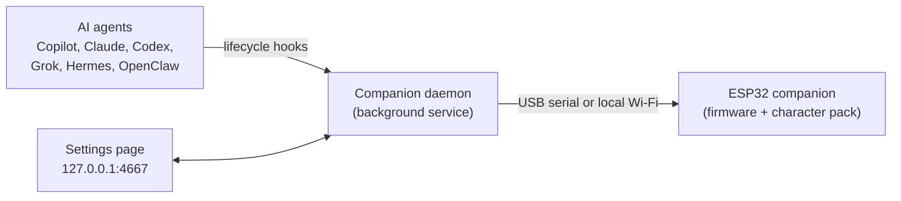

<p align="center">
  
</p>

<h1 align="center">ESP32 Agent Companion</h1>

<p align="center">
  An animated desk companion that shows what your AI coding agents are doing.
</p>

<p align="center">
  <a href="https://github.com/DanWahlin/esp32-agent-companion/releases/latest"></a>
  <a href="https://github.com/DanWahlin/esp32-agent-companion/actions/workflows/build.yml"></a>
</p>

ESP32 Agent Companion turns a
[Waveshare ESP32-S3 1.75" round AMOLED touchscreen](https://www.amazon.com/dp/B0FBWDL117)
into a character that reacts to your AI coding agents. When GitHub Copilot CLI,
Claude Code, Codex CLI, Grok Build, Hermes Agent, or OpenClaw starts working,
needs your approval, or finishes, the character shows it, along with a small
badge for the agent involved.

Everything runs locally. There's no cloud service, account, or subscription, and
the device works over USB or your local Wi-Fi.

<p align="center">
  
</p>

## Contents

- [Features](#features)
- [How it works](#how-it-works)
- [What you need](#what-you-need)
- [Quick start](#quick-start)
- [Step 1: Flash the firmware](#step-1-flash-the-firmware)
- [Step 2: Install the companion daemon](#step-2-install-the-companion-daemon)
- [Step 3: Finish setup in the settings page](#step-3-finish-setup-in-the-settings-page)
- [Using the device](#using-the-device)
- [Agent integrations](#agent-integrations)
- [Agent badges](#agent-badges)
- [Wi-Fi](#wi-fi)
- [Characters](#characters)
- [Command reference](#command-reference)
- [Troubleshooting](#troubleshooting)
- [Develop and customize](#develop-and-customize)

## Features

- **Agent-aware states:** Working, Needs attention, and Complete animations driven
  by your agents' lifecycle hooks, with sessions from several agents combined.
- **Agent badges:** small icons show which agent is working, waiting on you, or
  just finished.
- **Six supported agents:** GitHub Copilot CLI, Claude Code, Codex CLI, Grok Build,
  Hermes Agent, and OpenClaw.
- **Swappable characters:** the device holds one character pack at a time. It
  ships with Copilot, and you can install OpenClaw, Claude or your own pack over USB or Wi-Fi.
- **Settings page:** a local web page for agents, badges, characters, Wi-Fi, and
  the connection mode.
- **Natural motion:** eight looking directions, blinks, touch reactions, and a
  sleep cycle after two idle minutes.
- **Wi-Fi or USB:** run it tethered to your computer or from any USB power source
  on the same network.
- **Optional sound:** short local sound cues through the board's speaker connector.

## How it works



1. **Firmware** runs the animation on the device. You flash it once from a release.
2. **Hooks** in each agent's config report events such as "started a tool",
   "needs permission", and "finished".
3. **The companion daemon** runs in the background on your computer. It combines
   those events into one state, sends it to the device, and serves the settings page.

## What you need

| Item | Details |
| --- | --- |
| Device | **Waveshare ESP32-S3-Touch-AMOLED-1.75-B or 1.75-C** from [Amazon](https://www.amazon.com/dp/B0FBWDL117) or [Waveshare](https://www.waveshare.com/esp32-s3-touch-amoled-1.75.htm?sku=31262) |
| Cable | A USB data cable (charge-only cables won't work) |
| Computer | macOS or Linux. Windows works through [WSL 2](#windows-wsl-2). |
| Python | [3.10 or newer](https://www.python.org/downloads/), for flashing |
| Node.js and Git | [Node.js 24 LTS](https://nodejs.org/) (24.11 or newer) and Git, for the companion daemon |
| Speaker (optional) | A small two-pin speaker, if your board or enclosure doesn't include one |

## Quick start

1. [Flash the firmware](#step-1-flash-the-firmware) from the latest release.
2. [Install the companion daemon](#step-2-install-the-companion-daemon) with `npm run setup`.
3. [Finish setup in the settings page](#step-3-finish-setup-in-the-settings-page),
   which opens automatically.
4. Optional: [put the device on Wi-Fi](#wi-fi) so it can run away from your computer.

## Step 1: Flash the firmware

You don't need Arduino tools or the source code for this step. If you'd rather
build the firmware yourself, see [Build from source](docs/build-from-source.md).

1. From [Releases](https://github.com/DanWahlin/esp32-agent-companion/releases/latest),
   download the file ending in **`-firmware.zip`** and extract it.
2. Open a terminal in the extracted folder (it contains `flash.py`) and install
   the flashing tool:

   **macOS / Linux**

   ```bash
   python3 -m venv .venv
   .venv/bin/python -m pip install -r requirements.txt
   ```

   **Windows PowerShell**

   ```powershell
   py -3 -m venv .venv
   .\.venv\Scripts\python.exe -m pip install -r requirements.txt
   ```

3. Connect the device with the USB data cable, find its port, and flash it:

   **macOS / Linux**

   ```bash
   .venv/bin/python flash.py --list-ports
   .venv/bin/python flash.py --port /dev/cu.usbmodem2101
   ```

   **Windows PowerShell**

   ```powershell
   .\.venv\Scripts\python.exe flash.py --list-ports
   .\.venv\Scripts\python.exe flash.py --port COM5
   ```

   Use the port that `--list-ports` shows for your board. macOS ports look like
   `/dev/cu.usbmodem…`, and Linux ports look like `/dev/ttyACM0`. Type `FLASH`
   when prompted.

The installer verifies every file's checksum, then writes the bootloader,
partition table, application, and the default Copilot character. When it
finishes, the device restarts and the character starts looking around.

> [!WARNING]
> Flashing replaces the board's existing firmware and partition table. Back up
> anything you need from its previous firmware first.

<details>
<summary><strong>Flashing troubleshooting</strong></summary>

- **The device isn't listed:** make sure the cable carries data, and close any
  serial monitor that's using the port.
- **"Python 3.10 or newer is required":** the `python3` that comes with macOS is
  3.9. Install a newer Python, then recreate the environment, for example
  `python3.13 -m venv --clear .venv`, and install the requirements again.
- **Linux can't create the environment:** install your distribution's
  `python3-venv` package.
- **Download mode or connection problems:** see the
  [Waveshare board guide](https://www.waveshare.com/wiki/ESP32-S3-Touch-AMOLED-1.75).
- Don't flash the application `.bin` on its own or mix files from different
  releases. `flash.py` writes the matched set at the right addresses.

</details>

## Step 2: Install the companion daemon

The daemon connects your agents to the device. Clone the repository and run setup:

```bash
git clone https://github.com/DanWahlin/esp32-agent-companion.git
cd esp32-agent-companion
npm run setup
```

Setup does the following:

- Installs the daemon's dependencies and builds the character packs.
- Detects the agents on your computer and installs a hook for each one.
- Installs and starts a background service (a macOS LaunchAgent or a Linux
  systemd user service), so the daemon starts when you sign in.
- Prints any remaining one-time steps and opens the settings page.

Restart any agent sessions that were already open so they load the new hooks.

> [!TIP]
> The service saves your shell's `PATH` so it finds the same agents you do. If
> you install a new agent later, run `npm run setup` again.

<details>
<summary><strong>Linux: serial port permission errors</strong></summary>

Add your user to the `dialout` group, then sign out and back in:

```bash
sudo usermod -aG dialout "$USER"
```

</details>

<a id="windows-wsl-2"></a>
<details>
<summary><strong>Windows (WSL 2)</strong></summary>

Run your agent CLIs and the daemon **inside the same WSL 2 distribution**. Hooks
installed in WSL can't see agents running natively on Windows.

1. Install Node.js 24 LTS inside WSL.
2. If systemd isn't enabled, add this to `/etc/wsl.conf`, then run `wsl --shutdown`
   from PowerShell and reopen WSL:

   ```ini
   [boot]
   systemd=true
   ```

3. Windows doesn't share USB devices with WSL automatically. Install
   [`usbipd-win`](https://learn.microsoft.com/windows/wsl/connect-usb), connect
   the device, and run this in PowerShell:

   ```powershell
   usbipd list
   # Once, in an Administrator PowerShell, using the ESP32's BUSID:
   usbipd bind --busid <BUSID>
   # Each time you want to use the device from WSL:
   usbipd attach --wsl --busid <BUSID>
   ```

4. In WSL, confirm that `/dev/ttyACM*` or `/dev/ttyUSB*` exists, then follow the
   Linux steps above. While the device is attached to WSL, Windows apps can't use it.

The settings page link opens in your Windows browser.

</details>

## Step 3: Finish setup in the settings page

Setup opens the settings page for you. To open it again later, run:

```bash
npm run settings
```

The page runs only on your computer (`127.0.0.1`) and answers only the private
link that `npm run settings` opens, so other websites and devices can't reach it.
The link survives restarts, so you can bookmark it.

### Finish setting up your agents

Some agents need a one-time step before their hooks run. When that's the case,
a **Finish setting up your agents** panel lists exactly what to do. Each step
disappears on its own once the daemon sees it's done, and the browser tab shows
how many are left.

<p align="center">
  
</p>

The **Status** card shows how the device is connected, the installed character,
the current state and which agent is driving it, and how many agent sessions are
active. The pill in the top-right corner shows the connection at a glance.

### Agents and badges

The **Agents** card lists every supported agent with its detected version, hook
status, and whether it's enabled. An agent that's driving the display is
highlighted.

<p align="center">
  
</p>

| Control | What it does |
| --- | --- |
| **Show agent badges on the device** | Turns the [agent badges](#agent-badges) on or off |
| **Disable** / **Enable** | Stops or resumes that agent's control of the device, without touching its config |
| **Install hook** / **Reinstall** | Writes (or rewrites) the hook into the agent's config |
| **Remove hook** | Removes only this project's hook from the agent's config |

### Choose a character

The **Characters** card shows each character you can install, with the current
one marked **Installed**. The list includes every character in `characters/`.
When a `git pull` adds or updates one, the daemon rebuilds its pack
before showing the list or installing, so there's nothing extra to run.

<p align="center">
  
</p>

- Select **Install** to switch characters. A progress bar tracks the transfer,
  which takes about a minute, and the device restarts when it's done.
- Select **Add character…** to upload your own `.acpk` pack. Packs you've added
  have a **Remove** button.

### Wi-Fi and connection

The **Wi-Fi** card puts the device on your network and chooses how the daemon
reaches it.

<p align="center">
  
</p>

1. Plug the device in over USB and set **Connection** to **Auto**.
2. Enter your 2.4 GHz network name and password, then select **Connect device**.
   The daemon sends the credentials over USB and pairs with the device automatically.
3. Optionally, choose **Wi-Fi only** to keep using Wi-Fi while the cable only
   provides power.

| Mode | Behavior |
| --- | --- |
| **Auto** (default) | Uses USB when the cable is connected, otherwise Wi-Fi |
| **Wi-Fi only** | Always uses Wi-Fi; a connected USB cable only provides power |
| **USB only** | Only uses USB |

## Using the device

The character works as soon as it's flashed, even without the daemon.

| State | What you'll see | Triggered by |
| --- | --- | --- |
| Idle | Looks around and blinks | No agent activity |
| Working | Focused eyes, orbiting dots, and drifting binary digits | An agent is running a turn or tool |
| Needs attention | Curious head tilts and an amber question mark | An agent is waiting for permission or input |
| Complete | A short celebration | An agent finished a turn that used tools |
| Surprise | A quick spring-like recoil | Tapping the character |
| Sleep | Drowsy eyelids and drifting Zs | Two uninterrupted idle minutes; wakes after one minute |

**Swipe up** to open the on-device settings menu. Swipe down or select **Close**
to return to the character.

| Control | What it does |
| --- | --- |
| Wi-Fi status (top) | Shows the connection and network name. Tap it for network details and **Setup Wi-Fi**. |
| Brightness | Adjusts display brightness |
| Volume | Sets sound from Off to 100% (default 50%, remembered across restarts) |
| Character | Shows the installed character |
| Character state | Previews Idle, Working, Complete, Needs attention, or Surprise |

Sound uses the board's ES8311 codec and two-pin speaker connector. Connect a
compatible speaker if your board or enclosure doesn't include one.

## Agent integrations

Setup installs a hook for every agent it detects. Hooks only notify the daemon;
if the daemon or device isn't running, your agents keep working normally.

| Agent | Hook location | One-time step |
| --- | --- | --- |
| GitHub Copilot CLI | `~/.copilot/hooks/agent-companion.json` | None |
| Claude Code | `~/.claude/settings.json` | Accept Claude's folder-trust prompt if it asks |
| Codex CLI | `~/.codex/hooks.json` | Approve the hooks in Codex with `/hooks` |
| Grok Build | `~/.grok/hooks/agent-companion.json` | None |
| Hermes Agent | `~/.hermes/config.yaml` | Approve each hook the first time Hermes runs it |
| OpenClaw | A plugin registered with the `openclaw` CLI | Restart the OpenClaw Gateway |

Setup edits only the hook entries it owns, keeps a `.bak` copy of each file it
changes, and writes through symlinked config files, such as ones managed by a
dotfiles tool.

<details>
<summary><strong>Manage hooks from the command line</strong></summary>

```bash
npm run agents                     # List agents, versions, and hook status
npm run agents disable claude      # Stop an agent from driving the device
npm run agents enable claude
npm run agents install codex       # Install or reinstall one hook
npm run agents uninstall codex     # Remove one hook
```

Removing a Hermes hook doesn't revoke its approval. To clean that up too, run
`hermes hooks revoke "<command>"` with the command shown in its config.

</details>

<details>
<summary><strong>How agent events become device states</strong></summary>

- Active agent or subagent work maps to **Working**.
- Permission and input prompts map to **Needs attention**, which takes priority
  over every other session.
- A finished turn that used tools maps to **Complete**.
- Inactive sessions return to **Idle**.

Sessions from different agents and terminals are tracked separately and combined,
so one agent finishing doesn't hide another that's still working. Abandoned
sessions expire automatically, and active sessions are restored if the daemon
restarts. Grok Build can also run Claude Code's hooks, so the daemon ignores
those duplicate events while the Grok hook is installed.

</details>

## Agent badges

Badges show which agent is behind the current state. Working badges ride the
orbiting dots, Needs attention badges pulse amber opposite the question mark,
and Complete briefly shows the agents that just finished. Idle, Sleep, and
Surprise don't show badges.

<p align="center">
  
</p>

Badges are on by default. Turn them off with the switch on the settings page or
with `npm run badges off` (`npm run badges on` brings them back).

<details>
<summary><strong>Use your own badge icons</strong></summary>

The built-in icons are 24 x 24 pixel art made for this project. Some, like
OpenClaw's and Grok's, are simplified takes on the agent's own logo.

To replace one, put a PNG named after the agent (for example `copilot.png`) in
the `icons` folder of the daemon's data directory:

- macOS: `~/Library/Application Support/ESP32 Agent Companion/icons/`
- Linux: `~/.local/state/esp32-agent-companion/icons/`

The daemon converts 8-bit, non-interlaced PNGs to a 24 x 24 mask using alpha or
brightness. An optional `copilot.json` next to it can set the accent color used
for the icon and ring: `{ "color": "#RRGGBB" }`. Badges always use a dark fill.

</details>

## Wi-Fi

Wi-Fi lets the companion run from a wall adapter or any USB power source. Your
computer and the device need to be on the same local network, and the device
needs a 2.4 GHz network.

**From your computer (recommended).** With the device plugged in over USB, use
the settings page's [Wi-Fi card](#wi-fi-and-connection), or run:

```bash
npm run wifi "Your 2.4 GHz network"
```

The command asks for the password without showing it or saving it in your shell
history. The daemon sends the credentials over USB and stores only the device's
pairing token; it never saves your network name or password on the computer.

**From the device.** Swipe up, tap the Wi-Fi status, then select **Setup Wi-Fi**.
Join the temporary `Agent-Companion-XXXX` network with the eight-digit password
on screen, open <http://192.168.4.1>, and enter your network. Then reconnect your
computer to that network and pair it with the same code:

```bash
npm run pair 12345678
```

The setup network and code expire after ten minutes.

<details>
<summary><strong>Network requirements and security</strong></summary>

- Guest networks, client isolation, VPN policies, and firewalls that block local
  HTTP or UDP discovery can prevent Wi-Fi operation. USB always works.
- Wi-Fi credentials are stored only on the device.
- Requests from the daemon to the device are authenticated with the pairing
  token and stay on your local network.
- Bluetooth isn't supported.

</details>

## Characters

The device holds one character at a time. Switch from the settings page's
[Characters card](#choose-a-character), or run:

```bash
npm run character              # List the characters you can install
npm run character openclaw     # Install OpenClaw
npm run character claude       # Install Claude
npm run character copilot      # Switch back to Copilot
```

You can also pass the path to any `.acpk` pack, such as one from a release's
**`-characters.zip`**. The daemon remembers your choice.

<details>
<summary><strong>Why interrupted installs are safe</strong></summary>

The firmware erases the old pack's header first and writes the new header only
after the whole pack's SHA-256 checks out. It verifies the pack again at every
boot. If an install is interrupted, the device shows **No character installed**,
and the daemon reinstalls your last character as soon as it reconnects.

</details>

<details>
<summary><strong>Create your own character pack</strong></summary>

Packs must match the firmware's animation model: 13 tracks, 24 poses, and 5 blink
levels at 412 x 352. They use one of two layouts, Copilot-style base frames with
blink patches or OpenClaw-style full frames. Each character lives in
`characters/<id>/` with a `character.json`. See [characters/README.md](characters/README.md)
and `tools/character_pack.py` for the format. To check a pack:

```bash
python3 tools/character_pack.py validate path/to/pack.acpk
```

To draw a new character with AI image generation, from reference art through
blink synthesis to a finished pack, see [docs/character-art-notes.md](docs/character-art-notes.md).

</details>

## Command reference

Run these from the repository folder.

| Command | What it does |
| --- | --- |
| `npm run setup` | Installs the daemon, agent hooks, and background service. Add `-- --no-open` to skip opening the browser. |
| `npm run settings` | Opens the settings page |
| `npm run status` | Shows the connection, character, state, and any pending agent steps |
| `npm run agents` | Lists agents with their versions and hook status |
| `npm run agents enable\|disable <agent>` | Lets an agent drive the device, or stops it |
| `npm run agents install\|uninstall <agent>` | Installs or removes one agent's hook |
| `npm run badges on\|off` | Shows or hides agent badges |
| `npm run character [name\|path]` | Lists characters, or installs one |
| `npm run wifi "<network>"` | Puts the device on Wi-Fi over USB |
| `npm run pair <code>` | Pairs with a device set up from its own Wi-Fi screen |
| `npm run connection auto\|wifi\|usb` | Sets how the daemon reaches the device |

## Troubleshooting

<details>
<summary><strong>The device doesn't react to an agent</strong></summary>

1. Run `npm run status` and confirm the device is connected. It also lists any
   pending one-time agent steps.
2. Restart agent sessions that were open before you ran setup.
3. Check the settings page's **Agents** card: the agent should show
   **hook installed** and **enabled**.
4. If you installed the agent after running setup, run `npm run setup` again.

</details>

<details>
<summary><strong>The settings page is blank or says the link expired</strong></summary>

The page needs its private link. Run `npm run settings` to open it with the link.

</details>

<details>
<summary><strong>Wi-Fi won't connect</strong></summary>

- Use a 2.4 GHz network; the device doesn't support 5 GHz.
- Make sure your computer and the device are on the same network, and not a
  guest network with client isolation.
- Changing networks from the computer uses USB, so set **Connection** to
  **Auto** with the cable plugged in first.

</details>

<details>
<summary><strong>Where are the logs?</strong></summary>

- macOS: `~/Library/Logs/esp32-agent-companion.log`
- Linux: `journalctl --user -u esp32-agent-companion`

</details>

<details>
<summary><strong>Uninstall</strong></summary>

1. Remove the hooks you installed, for example `npm run agents uninstall claude`
   for each agent.
2. Stop and remove the background service.

   **macOS**

   ```bash
   launchctl bootout gui/$(id -u)/com.danwahlin.esp32-agent-companion
   rm ~/Library/LaunchAgents/com.danwahlin.esp32-agent-companion.plist
   ```

   **Linux**

   ```bash
   systemctl --user disable --now esp32-agent-companion.service
   rm ~/.config/systemd/user/esp32-agent-companion.service
   ```

3. Optionally, delete the daemon's data directory
   (`~/Library/Application Support/ESP32 Agent Companion` on macOS or
   `~/.local/state/esp32-agent-companion` on Linux).

</details>

## Develop and customize

**Character Lab** previews every character state in your browser using the same
C++ motion and rendering code as the device. It needs Python 3.10+, `clang++`,
and zlib (see [Build from source](docs/build-from-source.md)).

```bash
python3 tools/serve_preview.py
```

Then open <http://127.0.0.1:8765/character-preview.html>. You can switch
characters, pause, change playback speed, and trigger each state and touch
reaction.

<p align="center">
  
</p>

<details>
<summary><strong>Regenerate the OpenClaw sprites</strong></summary>

OpenClaw is rendered offline from a procedural 3D model based on its official SVG.
After changing the model:

```bash
npm ci --prefix characters/openclaw/model
npm run render --prefix characters/openclaw/model
python3 characters/openclaw/tools/export_openclaw_lab.py
```

The export writes the compressed frames that `tools/character_pack.py build`
packages into `build/characters/openclaw.acpk`. The intermediate PNG renders stay
local and are ignored by git.

</details>

### More documentation

- [Build from source](docs/build-from-source.md)
- [Development, architecture, hardware, and serial protocol](docs/development.md)
- [Creating a new character's art](docs/character-art-notes.md)
- [Tagging and publishing releases](docs/releases.md)

---

This is an independent project, not an official GitHub or Waveshare product.
GitHub Copilot and Claude artwork and product names belong to their respective owners.
