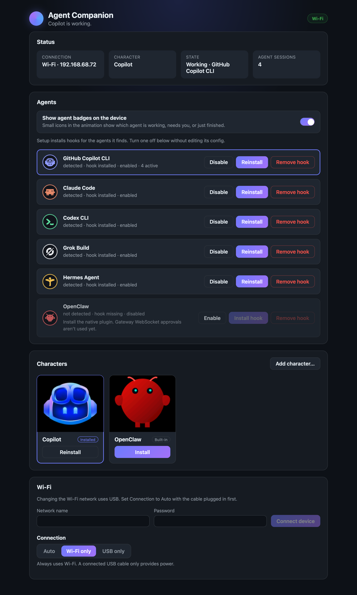

<p align="center">
  
</p>

# ESP32 Agent Companion

A small, expressive companion for your desk. Its first character is inspired by
GitHub Copilot and comes to life on a round AMOLED touchscreen: it looks around,
blinks, reacts when tapped, and can display Working, Complete, and Needs attention
states. After two uninterrupted Idle minutes, it sleeps for one minute and then
repeats the Idle/Sleep cycle.

It runs locally on the **Waveshare ESP32-S3-Touch-AMOLED-1.75-B or 1.75-C**.
No cloud account, subscription, or Wi-Fi is needed to run the
default character. Wi-Fi is optional for receiving agent hooks while powered
from something other than the computer.

## What it does

- **Natural motion:** smooth display presentation, eight looking directions, and occasional
  blinks. OpenClaw uses a character-specific 12 FPS walking cycle for responsive motion.
- **Touch reactions:** tap the character for a quick spring-like recoil and widened eyes,
  then return to Idle.
- **On-device settings:** swipe up to adjust brightness, sound, state, or local
  Wi-Fi, and see which character is installed.
- **Subtle sound cues:** original local cues accompany Working, Needs attention, Complete,
  Surprise, and settings actions when a speaker is attached.
- **Agent states:** focused eyes and orbiting dots for Working, a celebration for Complete,
  and curious head tilts for Needs attention.
- **Automatic sleep:** after two Idle minutes, the character sleeps for one minute
  with subtle movement, drowsy eyelids, and drifting Zs.
- **Compact graphics:** lossless sprite compression preserves the artwork while keeping
  the Copilot character pack around 9.54 MB.
- **Swappable characters:** the firmware is a shell that holds exactly one character
  pack in flash. It ships with Copilot, and the daemon can install OpenClaw or a
  custom pack over USB or Wi-Fi.
- **Works with your agents:** reacts to GitHub Copilot CLI, Claude Code, Codex CLI,
  Grok Build, Hermes Agent, and OpenClaw, and shows a small badge for each agent
  that's working or needs you.
- **Settings page:** a local web page for Wi-Fi, characters, agents, and badges,
  alongside the `npm run` commands.

The character works immediately in automatic Idle mode. Agent states can be
controlled through USB serial commands, the swipe-up settings menu, or the
included companion daemon. The daemon prefers USB when connected and
automatically falls back to a paired device on the same local Wi-Fi network.

### Optional: agent companion daemon

The TypeScript daemon connects AI agent lifecycle hooks to the device over USB
or local Wi-Fi.
It supports macOS and Linux directly, plus Windows through WSL 2. Install
[Node.js 24 LTS](https://nodejs.org/) (24.11 or newer) and flash the device first.

**macOS or Linux**

From the repository root, run one command:

```bash
npm run setup
```

That's it. Everything else is a single command from the repository root, too:

| Command | What it does |
| --- | --- |
| `npm run settings` | Opens the settings page in your browser |
| `npm run status` | Shows how the device is connected, its character, and its state |
| `npm run agents` | Lists detected AI agents, hook status, and enable/disable state |
| `npm run agents disable claude` | Stops one agent from driving the device (`enable` turns it back on) |
| `npm run wifi "Your Wi-Fi"` | Puts the device on your Wi-Fi (prompts for the password) |
| `npm run character` | Lists the characters you can install |
| `npm run character openclaw` | Installs a different character |
| `npm run pair 12345678` | Pairs a device set up on its own Wi-Fi screen |
| `npm run connection wifi` | Uses Wi-Fi even while a USB cable is plugged in for power (`auto` switches back) |
| `npm run badges off` | Hides the agent badges on the device (`on` shows them again) |

The settings page does the same things with buttons: it shows live status,
sets up Wi-Fi, switches the connection mode, enables or disables each agent, and
turns agent badges on or off. It also installs characters with a progress bar,
and you can add your own `.acpk` character from it. The daemon serves the page
only on `127.0.0.1`, and it only answers the private link that `npm run settings`
opens, so other websites and computers can't reach it. The link keeps working
across daemon restarts, so you can bookmark it. If you open the page without it,
the page tells you to run `npm run settings`. On WSL, the link opens in your
Windows browser.

<p align="center">
  
</p>

Setup installs the daemon's dependencies, builds the character packs, installs
hooks for detected agents, and installs a background service. The service keeps
a copy of your shell's `PATH` and `HERMES_HOME` so it finds the same agents you
do; if you install a new agent later, run `npm run setup` again. Setup needs
Python 3 for the character packs. The installer creates and starts a macOS LaunchAgent or
Linux systemd user service. If Linux reports a serial-port permission error, add
your user to the `dialout` group, then sign out and back in:

```bash
sudo usermod -aG dialout "$USER"
```

Supported agent hooks:

| Agent | Installed into | Notes |
| --- | --- | --- |
| Copilot CLI | `~/.copilot/hooks/agent-companion.json` | Existing older hooks keep working; setup rewrites our drop-in to the multi-agent form. |
| Claude Code | `~/.claude/settings.json` | Claude may ask you to trust the folder before it runs hooks. |
| Codex CLI | `~/.codex/hooks.json` | Approve new hooks once inside Codex with `/hooks`. |
| Grok Build | `~/.grok/hooks/agent-companion.json` | Grok can also run Claude hooks, so the daemon ignores those duplicate Claude invocations when the Grok hook is enabled. |
| Hermes Agent | `~/.hermes/config.yaml` | Hermes asks you to approve the shell hook the first time it runs. |
| OpenClaw | Plugin files in the daemon data directory | Plugin-only integration for lifecycle events; Gateway WebSocket approvals aren't used yet. |

Some agents need a one-time step before their hooks run: approving them in
Codex or Hermes, accepting Claude's folder-trust prompt, or restarting sessions
that were open during setup. You don't have to remember which. When setup
finishes, it lists what's left and opens the settings page, where a **Finish
setting up your agents** panel shows each remaining step. The daemon checks
Codex's and Hermes's approval records and watches for each agent's first event,
so every step disappears on its own once it's done. `npm run status` lists any
steps that are still pending. Pass `--no-open` to setup to skip opening the
browser.

Detected agents are enabled by default. Turn one off without editing its config:

```bash
npm run agents disable claude
npm run agents enable claude
```

You can also install or remove one hook at a time with
`npm run agents install codex` or `npm run agents uninstall codex`. Removing a
Hermes hook doesn't revoke its allowlist entry; if you want that cleaned up too,
run Hermes' own `hermes hooks revoke "<command>"` for the command shown in its
config.

**Windows through WSL 2**

Run **your agent CLIs and the daemon inside the same WSL 2 distribution**; hooks
installed in WSL can't control an agent running natively on Windows. Install Node.js inside WSL. If systemd is not enabled, add the following
to `/etc/wsl.conf`, then run `wsl --shutdown` from PowerShell and reopen WSL:

```ini
[boot]
systemd=true
```

Windows does not expose USB devices to WSL automatically, so install
[`usbipd-win`](https://learn.microsoft.com/windows/wsl/connect-usb), connect the
device, and open PowerShell:

```powershell
usbipd list
# Run once in an Administrator PowerShell, using the ESP32's BUSID:
usbipd bind --busid <BUSID>
# Run whenever the device needs to be attached to WSL:
usbipd attach --wsl --busid <BUSID>
```

In WSL, confirm that `/dev/ttyACM*` or `/dev/ttyUSB*` exists, then run the same
Linux installation commands shown above. While attached to WSL, the device is
not available to native Windows applications.

Restart any running agent CLI after installation so it loads the user-level hooks.
`npm run status` should report the device as connected. The daemon maps active
main-agent or subagent work to Working, permission and
elicitation prompts to Needs attention, verified tool-using turns to Complete,
and inactive sessions to Idle. Multiple CLI sessions are aggregated rather than
overwriting one another, and session IDs are namespaced by agent so different
tools can't collide. Timestamped leases discard abandoned work, while a private
local state file restores still-active sessions after a daemon restart.

#### Optional: pair the daemon over Wi-Fi

Wi-Fi lets the companion run from a USB wall adapter or other power source
without maintaining a USB data connection to the computer. The computer and
device must be able to reach each other on the same local network.

With the device connected over USB and the daemon running, configure and pair it
directly from the computer:

```bash
npm run wifi "Your 2.4 GHz network"
```

The command prompts for the password without displaying it or placing it in shell
history. The daemon sends the credentials over the existing USB connection,
stores only the device's random pairing token, and automatically enables Wi-Fi
fallback. It never writes the SSID or password to the computer.

Without USB, swipe up on the device, tap the Wi-Fi status at the top, then
**Setup Wi-Fi**. Join
the temporary `Agent-Companion-XXXX` network using the displayed eight-digit
password, open <http://192.168.4.1>, and enter the target network. After returning
the computer to that network, pair it with
`npm run pair 12345678`. The setup access point and code
expire after ten minutes.

By default the daemon uses USB whenever the cable is connected. To run over
Wi-Fi while the cable only provides power, run `npm run connection wifi`, and
`npm run connection auto` to go back. The choice is saved and applies to state
updates and character installs.

Wi-Fi credentials remain in ESP32 NVS. Runtime state requests are
token-authenticated and stay on the local network. Guest networks, client
isolation, VPN policies, or firewalls that block local HTTP or UDP discovery can
prevent wireless operation. Bluetooth is not implemented.

### Agent badges

When the daemon is connected to protocol 6 or newer firmware, the character can
show small circular badges for the agents currently driving it. Working badges
ride the orbiting activity ring, Needs attention badges fan out along the edge
opposite the question mark with an amber pulse, and Complete briefly shows the
agents that just finished. Badges draw on top of the character, and Idle, Sleep,
and Surprise don't show them.

Badges are on by default. Turn them off from the settings page or with:

```bash
npm run badges off
npm run badges on
```

The built-in glyphs are 24 x 24 pixel art drawn for this project. Some, like
OpenClaw's critter and Grok's ring, are simplified takes on the agent's own logo.
To use your own marks, put `<agent>.png` files in the daemon data directory's
`icons/` folder, for example
`~/Library/Application Support/ESP32 Agent Companion/icons/copilot.png` on macOS.
The daemon converts 8-bit non-interlaced PNGs to 24 x 24 masks and optionally
reads `<agent>.json` with `{ "color": "#RRGGBB" }` for the glyph and ring color;
badges always use a dark fill.

<p align="center">
  
</p>

## Install

### 1. Get the device and download a release

You need:

- **Waveshare ESP32-S3-Touch-AMOLED-1.75-B or 1.75-C:** [Buy from Waveshare](https://www.waveshare.com/esp32-s3-touch-amoled-1.75.htm?sku=31262)
  or [Amazon](https://www.amazon.com/dp/B0FBWDL117).
- A **USB data cable** and a macOS, Windows, or Linux computer.
- **[Python 3.10 or newer](https://www.python.org/downloads/)**. On Windows, include
  the Python launcher when installing.

From [Releases](https://github.com/DanWahlin/esp32-agent-companion/releases/latest), download
the file ending in **`-firmware.zip`** and extract it. You do **not** need Arduino IDE,
Arduino CLI, or the source repository to install a release.

Prefer to build it yourself? Follow the [source-build guide](docs/build-from-source.md).

### 2. Install the flashing software

Open a terminal **inside the extracted firmware folder**—the folder containing
`flash.py`, `manifest.json`, and `requirements.txt`.

**macOS / Linux**

```bash
python3 -m venv .venv
.venv/bin/python -m pip install -r requirements.txt
```

**Windows PowerShell**

```powershell
py -3 -m venv .venv
.\.venv\Scripts\python.exe -m pip install -r requirements.txt
```

This installs the pinned `esptool` flashing utility into a local environment.
Some Linux distributions also require their `python3-venv` package.

Check `python3 --version` first. The `python3` that comes with macOS is 3.9,
which is too old for `esptool`. If your environment was created with an older
Python, `flash.py` tells you so and shows how to recreate it with a newer one
(for example, `python3.13 -m venv --clear .venv`).

### 3. Connect and flash

Connect the device using the USB data cable. Close any serial monitor using it.
List the ports, then flash the port corresponding to your device:

**macOS / Linux**

```bash
.venv/bin/python flash.py --list-ports
.venv/bin/python flash.py --port /dev/cu.usbmodem2101
```

**Windows PowerShell**

```powershell
.\.venv\Scripts\python.exe flash.py --list-ports
.\.venv\Scripts\python.exe flash.py --port COM5
```

Replace the example port with the one listed for your board. Linux ports commonly
look like `/dev/ttyACM0`; macOS ports commonly look like `/dev/cu.usbmodem...`.

**Confirm when prompted.** The installer checks the bundle's hashes and programs
the matching bootloader, partition table, application, and default Copilot
character pack at their correct addresses. Do not upload the application `.bin` alone or mix files
from different releases.

**Flashing replaces the device's existing firmware and partition table.** Back up
anything needed from its previous firmware first. The installer does not run a
whole-chip erase.

When flashing finishes, the device restarts and the character begins looking
around. Tap it to try the touch reaction; it returns to Idle when the spring
finishes. Swipe up to open settings. The menu adjusts display brightness and
sound volume from Off through 100%, and chooses Idle, Surprise, Working, Complete,
or Needs attention. The top of the menu shows the Wi-Fi status and, when
connected, the network name; tap it to open local network setup and details.
The 50% default and subsequent volume changes persist across restarts. Swipe down
or tap Close to return to the character. The Wi-Fi page reports Connected,
Disconnected, Setup active, or Not configured along with the configured network
and current IP address.

Sound uses the board's ES8311 codec and two-pin speaker output. Connect a compatible
speaker to the board's speaker connector if your device or enclosure does not
include one. Audio stays local to the device.

If the device is not listed, check that the cable supports data. For connection or
download-mode problems, see the [Waveshare instructions](https://www.waveshare.com/wiki/ESP32-S3-Touch-AMOLED-1.75).

### Change the character

The device holds one character at a time. Copilot is installed when you flash
it, and the daemon can swap in another pack whenever the device is reachable
over USB or paired Wi-Fi (USB is used when both are available):

```bash
npm run character openclaw
npm run character copilot
```

Run `npm run character` on its own to list what's available. Built-in names come
from `build/characters/`, which the command builds from the repository's
validated art. You can also pass a path to any `.acpk` pack, such
as one from a release's **`-characters.zip`**. A character install takes about
a minute. The display shows progress, and the device restarts when it's done.
The daemon remembers your choice.

Installation is safe to interrupt. The firmware erases the old pack's header
first, writes the new header only after the whole pack's SHA-256 verifies, and
checks the pack again at every boot. If an install fails, the device shows
**No character installed**, and the daemon reinstalls your last character
automatically as soon as it reconnects.

Packs must use the firmware's animation model (13 tracks, 24 poses, 5 blink
levels at 412×352) and one of its two layouts: Copilot-style base frames with
blink patches, or OpenClaw-style full frames. `tools/character_pack.py`
documents the format and validates a pack:

```bash
python3 tools/character_pack.py validate path/to/pack.acpk
```

## Develop and customize

The native browser preview uses the same C++ motion and rendering code as the
device. Source artwork, blink generation, and firmware export tools are included.

### Character Lab

Use Character Lab to review every character state and animation locally before
uploading firmware to the device. Switch between Copilot and OpenClaw while
preserving the same native 13-track motion contract, blink levels, and effects.
OpenClaw is built offline from a procedural 3D model based on the official SVG
and is installed on the device as a character pack.
Character Lab requires Python 3.10+,
`clang++`, and zlib; see the [source-build guide](docs/build-from-source.md) for
platform prerequisites.

From the repository root, run:

```bash
python3 tools/serve_preview.py
```

Then open [http://127.0.0.1:8765/character-preview.html](http://127.0.0.1:8765/character-preview.html).
Each browser tab runs an isolated native renderer, with controls for character
selection, pausing, playback speed, touch reactions, each character state, and an
explicit OpenClaw wave preview. Character Lab remembers the selected character
across page reloads.

To regenerate the OpenClaw sprites after changing its 3D source model:

```bash
npm ci --prefix characters/openclaw/model
npm run render --prefix characters/openclaw/model
python3 characters/openclaw/tools/export_openclaw_lab.py
```

The export produces the committed, losslessly compressed RGB565 OpenClaw frames
and frame table; `tools/character_pack.py build` wraps them into
`build/characters/openclaw.acpk`. The individual intermediate PNG frames are generated
locally and ignored.

<p align="center">
  
</p>

- [Build from source](docs/build-from-source.md)
- [Development, preview, hardware, and serial commands](docs/development.md)
- [Tagging and publishing releases](docs/releases.md)

This is an independent project, not an official GitHub or Waveshare product.
GitHub Copilot artwork and product names belong to their respective owners.
