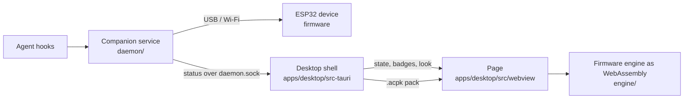

# Desktop Agent Companion - developer notes

The ESP32 Agent Companion's character in a transparent window on the desktop.
The user-facing summary is in the [root README](../README.md#desktop-agent-companion).

## How the pieces fit



There is one of everything:

- **One animation engine.** [`engine/engine.cpp`](engine/engine.cpp) compiles the
  firmware's own `CharacterMotion`, `SpriteMotion`, `SpriteRenderer`,
  `FullFrameRenderer`, `CharacterEffects` and `AgentBadges` from
  [`../firmware/AgentCompanion/src`](../firmware/AgentCompanion/src) to
  WebAssembly, unchanged. The wrapper does only what `AgentCompanion.ino` does
  around them: it owns the frame buffers, applies mode changes, and steps the
  engine once per frame.
- **One kind of pack.** The page loads the same `.acpk` file the device installs,
  from `build/characters` or from the characters added in Settings.
- **One source of truth.** The Rust shell polls the daemon's `status` every
  400 ms. That gives it the state, the agent badges (already filtered by the
  badge setting and cut to four, as the device gets them), the character and its
  pack file, and the desktop settings (shown or hidden, and the look). The desktop has no hooks, no state
  coordinator and no settings of its own.

## Building

```bash
python3 tools/character_pack.py build   # from the repository root: the .acpk packs
cd desktop
npm install
npm run build        # engine/build.mjs (needs Emscripten), then the page and app icon
npm test             # typecheck, then the engine parity test
cd apps/desktop/src-tauri
cargo test
cargo run
```

`npm run build` needs `em++` on `PATH`: `brew install emscripten` on macOS, or see
[emscripten.org](https://emscripten.org). The engine is one 110 KB JavaScript
file with the WebAssembly embedded, so the page loads it without a second fetch.

## Matching the device exactly

[`engine/test/parity.test.mjs`](engine/test/parity.test.mjs) builds the
repository's native character preview (`tools/character_preview.cpp`: the same
firmware sources, compiled for the host). It runs that beside the WebAssembly
engine with the same seed, and steps both through idle, working, attention,
complete, surprise and idle again. It checks that every pixel of every frame
matches, for Copilot, Claude and OpenClaw. Any change to the firmware's
animation code reaches the desktop at the next build, and CI fails if the two
ever disagree.

## The look

By default, the window is a small copy of the device: the round screen in a
matte black case, with the two buttons on its right edge. The page draws the
case in the canvas around the engine's frame, and the frame is the device's own
pixels on its own black screen, so it reads exactly as the device does.

With the **None** look, the character sits straight on the desktop, so the
engine keys the frame (`writeRgba` in `engine.cpp`):

- Black that connects to the edge of the round display is background. Black
  that the art encloses (inside a face) is kept. This is a flood fill from the
  edges, so dark seams and shadowed interiors survive however dark they are.
- The engine renders the character, keeps a copy, then renders the effects.
  Pixels that the effects changed over the background get their brightness
  back as alpha, because the device blends effects against black. A fading
  digit is then a fading digit, not a dark smudge.
- The badge disc's dark fill stays opaque, as it is on the device.

## Credits and licensing

The Desktop Agent Companion is by Darren Robinson, made with Dan Wahlin's
approval. The window itself (the transparent, click-through, draggable pet with
its tray, placement memory and multi-monitor checks) is his work, in
[apps/desktop](apps/desktop/README.md). The animation engine is the ESP32
Agent Companion firmware.

The repository carries no LICENSE file, so that approval is what settles reuse.
`copilot` renders a character of GitHub's, `claude` one of Anthropic's and
`openclaw` one of the OpenClaw project's.
